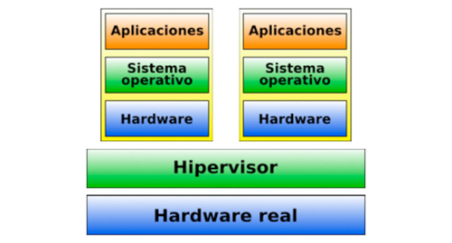

Aquí tienes un gráfico que ilustra cómo interactúa una máquina virtual con el sistema operativo y el hardware de la máquina anfitriona:

- **Máquina Virtual (Sistema Invitado)**: Simula un entorno completo de computadora dentro del sistema host.
- **Sistema Operativo Host**: Es el sistema operativo que gestiona el hardware físico y ejecuta el software de virtualización.
- **Hardware Físico**: Los componentes reales (CPU, memoria, almacenamiento) que son gestionados por el sistema operativo host y compartidos con la máquina virtual.

Las flechas indican el flujo de interacción entre estos componentes.